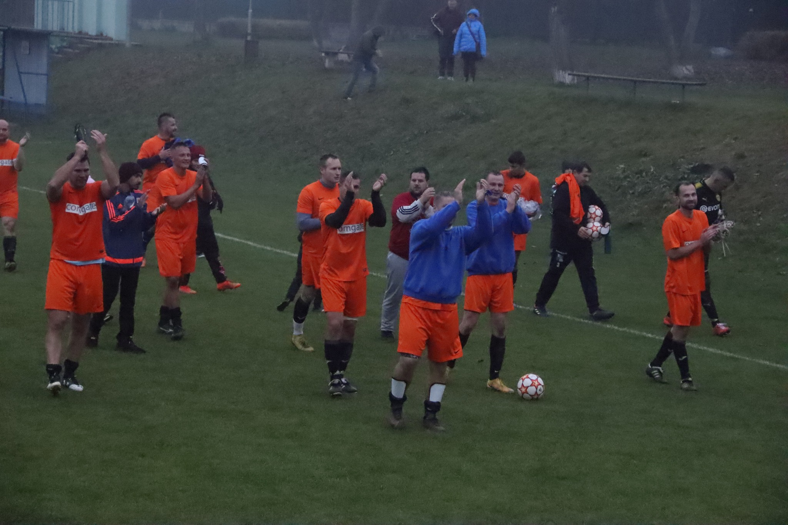

**TJ Sokol Velké Přílepy** byl založen roku 1920 a spadá do Okresního fotbalového svazu Praha-západ. Hřiště se nachází v ulici Májová 737. Historie klubu nese dlouholetou tradici a mnoho fotbalových úspěchů.

> „Aktuálně se nacházíme v tabulce mezi prvními v soutěži III. třída - skupina B s 26 body po 10 zápasech.“

Jelikož se chceme starat i o naše mladší fotbalisty, máme tu i pro ně **JFK Velké Přílepy**, kde jsou fotbalisté ve věku 5-13 let. Tento fotbalový oddíl vznikl jako občanské sdružení rodičů v roce 2010. Rodiče dětí je podporují z příspěvků za docházku do fotbalového oddílu a také je podporují sponzoři. Dětem při trénincích někdy pomáhají i někteří z hráčů za TJ Sokol Velké Přílepy, ti mohou předat dětem cenné zkušenosti.

